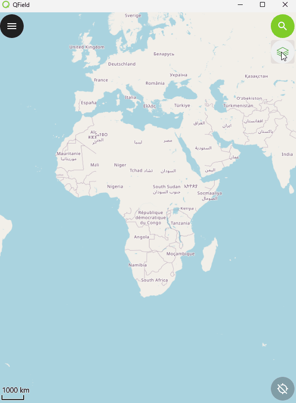

# QField Next Theme Plugin

QField app-wide plugin for cycling to the next map theme.

To install the latest version in QField, choose to **Install plugin from URL** with the following:

`https://github.com/hotosm/qfield-next-theme-plugin/releases/latest/download/qfield-next-theme-plugin.zip`

## Rationale

- Initially, a user wanted a plugin to easily cycle base layers
  between OSM & Satellite.
- While it's possible to cycle layers & map themes easily in the sidebar,
  then wanted a simple one-click button in the UI to do this.
- Instead of developing a flaky baselayer switcher (as layers can vary so
  much per project), I decided to use the already existing Theme
  API for QField.
- Baselayers can be configured in Themes (Satellite & OpenStreetMap),
  then cycled using this new button.

## Screenshot

The plugin button can be seen at the top right:

